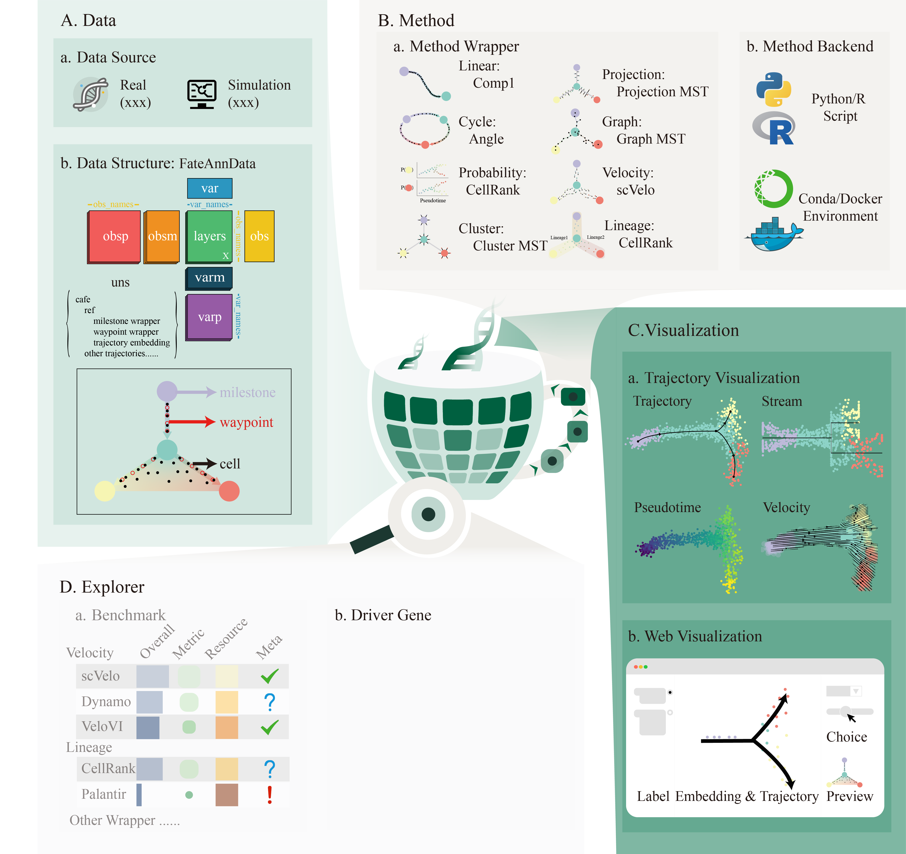

[](https://github.com/HuangDDU/CellFateExplorer/actions/workflows/test.yml)
[](https://cellfateexplorer.readthedocs.io/en/latest/)

# Cafe: An integrated platform for exploring cell fate

**Cafe (Cellular Fate Explorer)** is an integration platform for *inferring*, *visualizing* and *benchmarking* cell fate trajectory for single-cell RNA-seq data.😁

## Framework



## Installation

See [here](./docs/installation.md)

## Quick Start

You can run the [quickstart.ipynb](https://cellfateexplorer.readthedocs.io/en/latest/tutorial/quickstart/) using jupyter noboker to learn the basic function of tools quickly.

## Project shedule

- [x] Main framework code
- [x] Document construction: intsruction, tutorial, API
- [x] [🔗](./docs/development_document/shedule/data.md)Data module: FateAnnData data structure, data collection.
- [ ] [🔗](./docs/development_document/shedule/method.md)Methods module: 4 backend, trajectory methods for 8 wrapper.
- [ ] [🔗](./docs/development_document/shedule/benchmark.md)Benchmark: comprehensive metric and benchmark.
- [ ] [🔗](./docs/development_document/shedule/plot.md)Plot: beautiful plot.
- [ ] [🔗](./docs/development_document/shedule/downstream_analysis.md)Downstream analysis module: Interactive web platform, driver gene and GRN.

## Document

1. Links: For [`User`](https://cellfateexplorer-cellfateexplorer.readthedocs-hosted.com/en/latest/api/), for [`Developer`](https://cellfateexplorer-cellfateexplorer.readthedocs-hosted.com/en/latest/api/)

2. If you want to build the docs locally, run the following command in now conda environment.

    ```bash
    pip install -r docs/requirements.txt
    mkdocs serve
    ```
