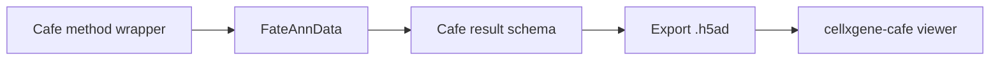
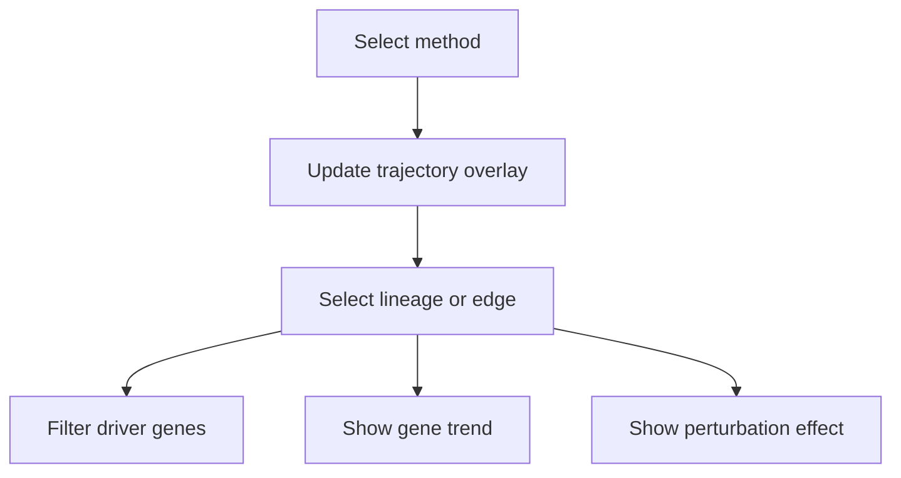

# cellxgene-cafe Integration

cellxgene-cafe should serve as the interactive viewer for Cafe results. The goal is not to replace notebooks, but to make trajectory, velocity, benchmark, and downstream outputs inspectable by collaborators.

## Integration Principle

Cafe should write standard fields into `AnnData`; cellxgene-cafe should read those fields.



## Viewer Priorities

| Priority | Feature | Required schema fields |
|----------|---------|------------------------|
| P0 | color by pseudotime, lineage, terminal state | `obs["cafe_pseudotime"]`, `obs["cafe_lineage"]` |
| P0 | inspect embedding | `obsm["X_umap"]` or `obsm["X_cafe_embedding"]` |
| P1 | show velocity arrows | `obsm["cafe_velocity"]` |
| P1 | show milestone network overlay | `uns["cafe_milestone_network"]` |
| P1 | switch method result | `uns["cafe"]["trajectory_history_dict"]` or exported schema |
| P2 | view benchmark table | `uns["cafe_benchmark"]` |
| P2 | view driver genes and gene trends | `uns["cafe_driver_genes"]` |
| P2 | view GRN edges | `uns["cafe_grn"]` |
| P3 | view perturbation effect | `uns["cafe_perturbation"]` |

## Minimal Export Contract

Before opening a result in cellxgene-cafe, Cafe should ensure:

```python
adata.obs["cafe_pseudotime"]          # numeric
adata.obs["cafe_lineage"]             # categorical or string
adata.obs["cafe_terminal_state"]      # categorical or string, optional
adata.obsm["X_cafe_embedding"]        # numeric matrix, optional if X_umap exists
adata.obsm["cafe_velocity"]           # numeric matrix, optional
adata.uns["cafe_milestone_network"]   # table-like graph
```

## Interaction Design



The viewer should support a common analysis loop:

1. Select a method result.
2. Check whether the trajectory direction is plausible.
3. Select a branch or edge.
4. Inspect driver genes or gene trends.
5. Compare with benchmark scores or warnings.

## Validation Before Viewer Launch

Add a lightweight validation step in Cafe before exporting:

| Check | Reason |
|-------|--------|
| embedding exists | viewer needs coordinates |
| pseudotime is finite | color scale should not break |
| lineage labels are strings/categories | stable UI labels |
| milestone network has `from`, `to`, `length` | graph overlay |
| velocity dimension matches embedding | arrow rendering |
| downstream tables have required columns | table and filter UI |

This validation should report warnings instead of silently failing.
