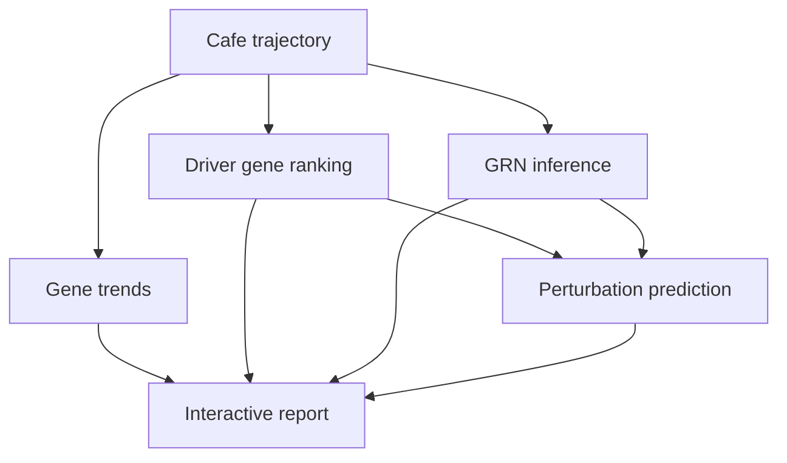

# Downstream Analysis Roadmap

Downstream analysis should turn a trajectory result into biological interpretation: which genes drive a transition, which regulators control them, and how perturbations may redirect fate.

## Scope

## Priority Modules

| Priority | Module | Purpose |
|----------|--------|---------|
| P0 | branch-specific gene trends | explain expression dynamics along pseudotime |
| P0 | lineage driver genes | identify genes associated with terminal fate choice |
| P1 | GRN wrapper | connect regulators to target genes |
| P1 | cellxgene-cafe display | inspect trajectory and downstream results interactively |
| P2 | perturbation prediction | predict fate shift after gene perturbation |
| P2 | trajectory alignment | compare dynamic programs across datasets |

## Gene Trend Analysis

For each gene \(g\) and lineage \(k\):

\[
y_{ig}^{(k)} = s_{g,k}(\tau_i) + \epsilon_i
\]

The first implementation can use simple smoothers or generalized additive models. The important output is a transition-aware table:

| gene | lineage | score | trend_type | peak_time |
|------|---------|-------|------------|-----------|

## Driver Gene Analysis

Driver genes should be ranked per lineage or edge:

\[
D(g, e) =
\left|\operatorname{cor}(x_g, \alpha_e)\right|
\times
\operatorname{specificity}(g, e)
\]

Candidate wrappers:

- CellRank lineage drivers
- Dynamo vector-field regulators
- random forest feature importance from position prediction
- branch-specific differential expression

## GRN Inference

Candidate wrappers:

- SCENIC / pySCENIC
- GRNBoost2
- CellOracle
- Dynamo regulatory analysis

Cafe should normalize GRN outputs to:

| regulator | target | lineage_or_edge | weight | sign | evidence |
|-----------|--------|-----------------|--------|------|----------|

## Perturbation Prediction

Perturbation output should be expressed as a fate or transition shift:

\[
\Delta P_{k}^{(g)} =
P(y = k \mid \operatorname{perturb}(g)) - P(y = k)
\]

Candidate tools:

- CellOracle perturbation simulation
- scGen / CPA-style latent perturbation models
- GEARS-like perturbation models
- method-specific vector field perturbation

## cellxgene-cafe Connection

The downstream module should export results through the [Cafe Result Schema](../../user_guide/cafe_result_schema.md), so cellxgene-cafe can display:

- pseudotime and lineage coloring,
- velocity arrows,
- milestone network overlay,
- driver gene tables,
- gene trends,
- GRN edge tables,
- perturbation effect tables.

## Student Deliverables

Milestone 1:

- [ ] run one gene-trend analysis on a standard dataset
- [ ] run one CellRank-style driver gene analysis
- [ ] write a short method survey for GRN and perturbation tools
- [ ] export one result into the Cafe result schema

Milestone 2:

- [ ] implement `DriverGeneWrapper` design draft
- [ ] implement `GRNWrapper` design draft
- [ ] create a downstream demo notebook
- [ ] add interactive display requirements for cellxgene-cafe

Milestone 3:

- [ ] complete one biological case study
- [ ] compare driver genes with known markers
- [ ] create publication-quality downstream figures
