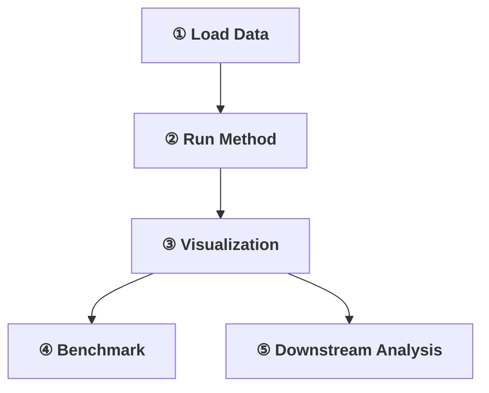

# Cell Fate Prediction with Cafe

## What is Cell Fate Prediction?

**Cell fate prediction** is the task of inferring the developmental trajectories of cells from single-cell RNA sequencing (scRNA-seq) data. In a developing tissue or differentiating system, cells transition through continuous states — from progenitor cells to fully differentiated cell types. Understanding these transitions is fundamental to developmental biology, disease progression, and regenerative medicine.

### The Core Problem

Given a snapshot of gene expression profiles from thousands of individual cells (scRNA-seq data), the goal of cell fate prediction is to:

1. **Recover the underlying developmental topology** — the branching structure of how cell states relate to each other.
2. **Order cells along trajectories** — assign each cell a pseudotime value representing its position along a differentiation path.
3. **Identify lineage branch points** — detect where a progenitor population diverges into distinct terminal fates.
4. **Quantify transition dynamics** — measure the direction and speed of cellular transitions (e.g., via RNA velocity).

### Why is it Challenging?

- **Static snapshots**: scRNA-seq is destructive — we only observe each cell once, never see transitions directly.
- **High dimensionality**: Each cell is measured across ~20,000 genes, with substantial technical noise.
- **Complex topologies**: Trajectories can be linear, branching, convergent, or cyclic.
- **Method diversity**: Dozens of trajectory inference methods exist, each with different assumptions, strengths, and weaknesses.

## How Cafe Addresses This Problem

Cafe (Cellular Fate Explorer) provides an **integrated platform** that unifies the three essential stages of cell fate analysis:

### 1. Unified Data Structure — FateAnnData

`FateAnnData` extends AnnData with cafe metadata (`uns["cafe"]`), auto-detected prior information, and multi-trajectory storage. All methods output into a unified `MilestoneNetwork` (milestones + progressions + divergence regions). See [Data Structure](data_structure.md).

### 2. Trajectory Inference

Diverse methods — pseudotime, end-state probabilities, RNA velocity, optimal transport — run via four backends (Python function, Conda, CFE Docker, Dynverse Docker) and output through one of 11 wrapper types into a unified `MilestoneNetwork`. See [Method Wrappers](method_wrappers.md).

### 3. Visualization

Embedding-based trajectory curves, method-specific wrapper views, velocity streams, and benchmark comparison plots. See [Plot Module](plots.md).

### 4. Benchmarking

Topology similarity, cluster assignment accuracy, pseudotime correlation, velocity coherence, and feature importance. See [Metric Module](metrics.md).

<h3>Task Flow</h3>

## References

- The Cafe framework preprint: [Cafe: An integrated platform for exploring cell fate](https://www.biorxiv.org/content/10.1101/2025.02.04.636565v3) (bioRxiv, 2025)
- [dynverse](https://github.com/dynverse/dynverse) — a comparison framework that inspired Cafe's wrapper classification
- [Single-cell pseudotime methods repository](https://github.com/agitter/single-cell-pseudotime) — community-curated list of trajectory inference methods
