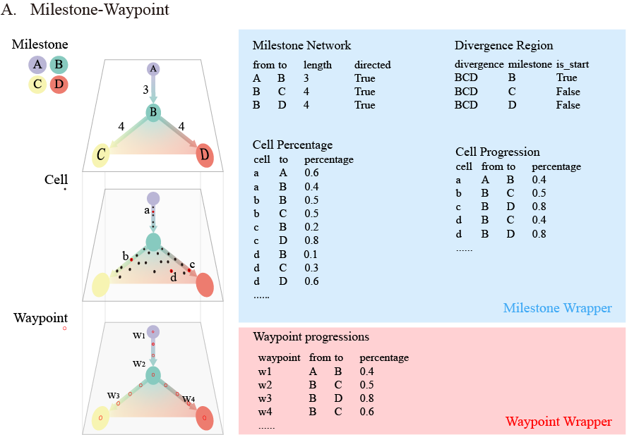

# Data Structures

Cafe extends the standard single-cell data model with two specialized structures: `FateAnnData` (the container) and `MilestoneWrapper` (the trajectory).

---

## FateAnnData

[**FateAnnData**](../api/data/fate_anndata.md) extends [AnnData](https://anndata.readthedocs.io/) and stores all Cafe metadata under `uns["cafe"]`, so it remains compatible anywhere an `AnnData` is expected.

### The `cafe_dict` Structure

```
fadata.uns["cafe"]  (cafe_dict)
├── id                              # Unique identifier
├── model_name                      # Currently active trajectory
├── prior_information               # Auto-detected: cluster, basis, start_cell
├── wrapper_type                    # Current wrapper type
└── trajectory_history_dict         # All trajectory results
    ├── "ref"                       # Reference trajectory
    │   ├── milestone_wrapper       # MilestoneWrapper object
    │   ├── waypoint_wrapper        # WaypointWrapper object
    │   ├── raw_wrapper_dict        # Raw method output
    │   ├── trajectory_embedding    # Cached embedding positions
    │   └── pseudotime_from_<...>   # Cached pseudotime
    ├── "scvelo"                    # scVelo trajectory
    └── ... (other methods)
```

### Multi-Trajectory Storage

The `trajectory_history_dict` stores results from multiple method runs in a single `FateAnnData` object. This enables method comparison and benchmarking against a reference trajectory without duplicating the expression matrix.

### Prior Information
  > Pior infomation is the key parameter for many plotting and method functions. Through automatic storage here, user rarely needs to specify them when calling these functions.
  - `cluster` (Cafe auto-detects it from `obs.columns`, checking `"clusters"`, `"celltype"`)
  - `basis` (Cafe auto-detects it from `obsm.keys()`, checking `"X_umap"`, `"X_tsne"`, `"X_pca"`),
  - `start_cell` should be set manually.

## Milestone Wrapper and Waypoint Wrapper

[**MilestoneNetwork**]((../api/data/fate_milestone_wrapper.md)) models a trajectory as a graph: nodes (milestones) represent key cell states, edges represent transitions with direction and length.

[**WaypointWrapper**](../api/data/fate_waypoint_wrapper.md) densely samples the trajectory by placing evenly-spaced waypoints along edges. It not olny reduce computational complexity while visualizing.


### Core DataFrames Instruction 



#### For Milestone Wrapper

| DataFrame | Purpose |
|-----------|---------|
| `milestone_network` | Graph topology: `from`, `to`, `length`, `directed` |
| `progressions` | Per-cell edge assignment: which edge a cell is on and how far along (0–100%) |
| `milestone_percentages` | Per-cell milestone membership (proportions sum to 1). Convertible to/from `progressions` |
| `divergence_regions` | Annotated branch points: which milestones form each divergence region |

#### For Waypoint Wrapper

| DataFrame | Purpose |
|-----------|---------|
| `waypoint progressions` | Per-waypoint edge assignment: which edge a cell is on and how far along (0–100%) |


### Key Capabilities

- **Subsetting** by cells or edges, for zooming into trajectory regions
- **Milestone renaming** with automatic propagation across all DataFrames
- **Edge-length adjustment** by cell load for better visualization
- **Merge operations** for hierarchical refinement: replace a coarse milestone with a fine-grained sub-trajectory
- **Color management**: milestones auto-colored from cluster palettes; cell colors mixed from milestone colors weighted by membership


